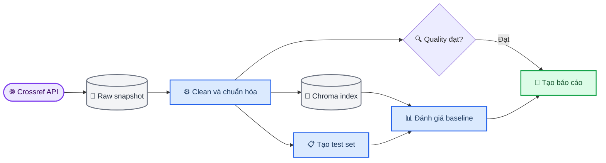

# Báo cáo cá nhân — Day 10: Data Pipeline & Data Observability

_Báo cáo phần việc của Duy trong nhóm Nova, hoàn thành ngày 26/09/2026._

---

## 👤 1. Thông tin cá nhân

| Thông tin       | Nội dung                                                                                                                    |
| -----------------| -----------------------------------------------------------------------------------------------------------------------------|
| Họ và tên       | Phạm Đình Duy                                                                                                               |
| MSSV            | 2A202602913                                                                                                                 |
| Khóa/Lớp        | K4-L3B                                                                                                                      |
| Tên nhóm        | Nova                                                                                                                        |
| Vai trò chính   | Evaluation và tích hợp Baseline Pipeline                                                                                    |
| Repository      | [K4-L3B-DAY10-Nova-DataPipelineDataObservability](https://github.com/Dzzuy/K4-L3B-DAY10-Nova-DataPipelineDataObservability) |
| Ngày hoàn thành | 2026-09-26                                                                                                                  |

## 📋 2. Vai trò và phạm vi công việc

### Phần việc sở hữu

| Module/deliverable | File/hàm phụ trách | Input nhận vào | Output bàn giao | Trạng thái |
| --- | --- | --- | --- | --- |
| Bộ benchmark CP2 | `src/evaluation/testset.py`, `build_test_set()` | DataFrame sạch gồm 24 bài báo | Bộ test 10 câu tại `data/eval/test_set.json` | Hoàn thành |
| Tích hợp baseline CP3 | `src/pipelines/phase1.py`, `run_phase1_pipeline()` | Raw records, cấu hình và các module của pipeline | Metrics và báo cáo baseline | Hoàn thành |
| Kiểm tra vector retrieval | `embeddings.py`, `index.py`, `qa.py` | Clean dataset và 10 câu benchmark | Collection `papers-baseline` gồm 24 documents | Đã xác minh, không sửa code |

### Việc hỗ trợ ngoài phạm vi chính

| Hoạt động | Thành viên/module được hỗ trợ | Kết quả |
| --- | --- | --- |
| Tích hợp branch observability | An — `quality.py`, `reporting.py` | Ghép quality, freshness và reporting vào CP3 rồi chạy lại toàn tuyến |
| Kiểm tra đầu vào CP1 | Thanh — ingestion và cleaning | Xác nhận 24 dòng sạch, 24 `paper_id` duy nhất và không thiếu trường dùng cho benchmark |
| Cấu hình LLM evaluation | Evaluation pipeline | Chuyển sang OpenRouter và xác nhận 10 lượt judge không dùng fallback |

Tôi không nhận ownership đối với `crossref.py`, `cleaning.py`, `quality.py`, `reporting.py`, `corruption.py` hoặc `corruption_flow.py`. Đây là phần việc của các thành viên khác.

## ✅ 3. Kết quả theo vai trò

| Nhiệm vụ đã thực hiện | File/hàm/artifact liên quan | Kết quả bàn giao | Cách xác minh |
| --- | --- | --- | --- |
| Sinh benchmark có thể tái lập | `build_test_set()` | 10 câu trên 10 papers khác nhau | Chạy lệnh kiểm tra CP2 trong lab guide |
| Phân bổ câu hỏi theo bốn loại | `data/eval/test_set.json` | 3 summary, 3 authors, 2 date, 2 categories | Đếm `question_type` trong JSON |
| Xây dựng baseline orchestration | `run_phase1_pipeline()` | Nối raw → clean → index → evaluation → quality → report | `python script/run_phase1.py` |
| Kiểm tra retrieval và answer quality | `baseline_metrics.json` | Hit Rate 1.0, Token F1 1.0 | Đối chiếu file metrics và answers |
| Tích hợp quality gate | `baseline.json`, `phase1_report.md` | GX pass, freshness pass | Đối chiếu quality artifact và report |

Output chính trong phần việc của tôi là bộ benchmark 10 câu và baseline pipeline chạy end-to-end. Lần chạy gần nhất ghi nhận 24 raw records, 24 clean records, 24 documents trong Chroma và 10 mẫu evaluation. Các baseline metrics đều đạt 1.0; LLM judge chấm điểm trung bình 5/5 và không có lượt nào dùng fallback.

Các commit chính dùng làm bằng chứng:

- `7956798 feat: build CP2 evaluation benchmark`
- `5b236a5 feat: integrate CP3 baseline pipeline`
- `64120d7 merge: integrate observability for CP3`
- `b99f4fa merge: complete CP3 baseline pipeline`

## ⚙️ 4. Giải thích phần kỹ thuật đã thực hiện

### Vấn đề cần giải quyết

CP2 cần một bộ câu hỏi cố định để đánh giá retrieval và câu trả lời. Nếu chọn ngẫu nhiên mỗi lần chạy, kết quả giữa baseline, corrupted và repaired sẽ không còn so sánh trực tiếp được. CP3 cần một hàm orchestration duy nhất để tạo lại toàn bộ baseline artifacts theo đúng thứ tự phụ thuộc.

### Cách triển khai benchmark

Tôi kiểm tra trước các cột bắt buộc gồm `paper_id`, `title`, `summary`, `authors_joined`, `categories_joined` và `published`. Hàm dừng bằng `ValueError` nếu dataset có dưới 10 dòng hoặc thiếu cột. Sau đó, hàm chọn 10 vị trí trải đều trên DataFrame thay vì lấy 10 dòng đầu. Cách này vẫn deterministic nhưng bao phủ dữ liệu tốt hơn.

Bốn loại câu hỏi được gán theo vòng lặp `summary → authors → date → categories`. Ground truth của câu summary là câu đầu tiên trong abstract; ba loại còn lại lấy trực tiếp từ metadata đã làm sạch. Mỗi câu giữ `ground_truth_doc_ids` để evaluation kiểm tra tài liệu đúng có xuất hiện trong top-k retrieval hay không.

### Cách triển khai baseline pipeline

`run_phase1_pipeline()` ưu tiên đọc raw snapshot đã có. Chỉ khi `REFRESH_SOURCE=1` hoặc raw records chưa tồn tại thì pipeline mới gọi lại Crossref. Clean DataFrame được lưu thành CSV và JSON, rồi được đưa vào Chroma `PersistentClient` để tạo collection baseline. `PersistentClient` lưu collection trong thư mục local giữa các lần chạy.[^1]

Test set chỉ được tạo lại khi chưa tồn tại, khi refresh nguồn hoặc khi `REFRESH_TEST_SET=1`. Sau evaluation, pipeline gọi quality checks, freshness report và sinh báo cáo Markdown. GX nhận DataFrame thông qua pandas Data Source, Data Asset và whole-dataframe Batch Definition.[^2]

### Input, output và contract

| Thành phần | Mô tả |
| --- | --- |
| Input benchmark | DataFrame sạch có ít nhất 10 dòng và đủ sáu cột bắt buộc |
| Output benchmark | 10 object gồm `id`, `question_type`, `question`, `ground_truth`, `ground_truth_doc_ids` |
| Input pipeline | `Settings`, raw records và các module đã triển khai |
| Output pipeline | Source summary, metrics, quality, freshness và đường dẫn report |
| Module phụ thuộc | Ingestion, cleaning, Chroma index, evaluation, observability và reporting |
| Module sử dụng output | Corruption flow dùng lại baseline metrics và cùng test set để so sánh |
| Điều kiện lỗi | Dataset rỗng, thiếu cột, dưới 10 papers, thiếu model cache hoặc module phụ thuộc chưa hoàn thiện |

### Cách xác minh

```bash
python -c "from core.config import load_settings; from evaluation.testset import build_test_set; import pandas as pd; s=load_settings(); df=pd.read_json(s.paths.clean_json); ts=build_test_set(df, s.paths.eval_testset); print(f'Sinh được {len(ts)} câu hỏi test')"

python script/run_phase1.py
```

- **Kết quả mong đợi:** 10 câu benchmark, 24 documents được index, quality gate pass và báo cáo Phase 1 được tạo.
- **Kết quả thực tế:** 10 câu benchmark, 24 documents, Hit Rate 1.0, Token F1 1.0, Judge Accuracy 1.0, Mean Judge Score 5.0 và quality gate `True`.
- **Artifact/log:** `data/eval/test_set.json`, `data/results/baseline_metrics.json`, `data/results/baseline_answers.json`, `data/quality/baseline.json`, `data/reports/phase1_report.md`.

## 🎯 5. Một quyết định kỹ thuật quan trọng

- **Bối cảnh:** Cần chọn 10 papers từ 24 papers để tạo test set cố định.
- **Các phương án đã cân nhắc:** Lấy 10 dòng đầu, chọn ngẫu nhiên có seed, hoặc chọn các vị trí trải đều.
- **Phương án đã chọn:** Chọn 10 vị trí trải đều và giữ nguyên thứ tự DataFrame.
- **Lý do:** Lấy 10 dòng đầu dễ lệch về nhóm bài mới nhất. Chọn ngẫu nhiên cần quản lý seed và có thể thay đổi khi số dòng thay đổi. Chọn trải đều đơn giản, deterministic và lấy mẫu trên toàn bộ dataset.
- **Bằng chứng:** Chạy hàm hai lần cho kết quả giống nhau; test set có 10 `paper_id` khác nhau và retrieval đạt 10/10 hits.

## 🔧 6. Một lỗi hoặc blocker đã xử lý

- **Triệu chứng:** Khi build index lần đầu, chương trình báo không thể kết nối `https://huggingface.co` và model chưa có trong local cache.
- **Lệnh tái hiện:** Chạy `LocalEmbeddingIndex.build()` với model `sentence-transformers/all-MiniLM-L6-v2` trong môi trường bị hạn chế DNS.
- **Nguyên nhân gốc:** `SentenceTransformer` cần tải model lần đầu nhưng môi trường chạy không có quyền mạng; cache local lúc đó chưa có model.[^3]
- **Cách xử lý:** Cho phép tải model một lần, sau đó chạy lại với `HF_HUB_OFFLINE=1` và `TRANSFORMERS_OFFLINE=1` để dùng cache.
- **Cách xác minh:** Collection `papers-baseline` có 24 documents, retrieval đạt 10/10 hits và pipeline end-to-end chạy thành công.
- **Điều học được:** Cài package chưa có nghĩa là embedding model đã được tải. Khi cần chạy offline, phải chuẩn bị model cache trước.

Một blocker khác là `quality.py` và `reporting.py` còn `NotImplementedError` trong lúc tôi làm CP3. Tôi không viết thay phần của An. Tôi kiểm thử contract bằng mock trước, sau đó merge branch của An và chạy lại bằng implementation thật. Kết quả cuối cùng là GX pass, freshness pass và report được tạo đúng đường dẫn.

## 🔄 7. Hiểu biết về luồng end-to-end



1. Crossref payload được lưu nguyên bản để giữ data lineage. Records sau khi parse được cleaning, deduplicate theo `paper_id`, tính `age_days` và ghép `text_for_embedding`. Text này được embedding và nạp vào Chroma.
2. Mỗi test case giữ document ID chuẩn. Retrieval hit bằng `True` khi ít nhất một ID chuẩn xuất hiện trong danh sách documents truy xuất. Token F1 đo mức trùng token giữa câu trả lời và ground truth.
3. Quality checks kiểm tra cấu trúc và tính hợp lệ như null, unique, row count và độ dài summary. Freshness monitoring tập trung vào tuổi dữ liệu, dùng `age_days > 180` và ngưỡng stale ratio 25%.
4. Cùng một test set phải được dùng cho baseline, corrupted và repaired. Nếu thay câu hỏi giữa các trạng thái, chênh lệch metric có thể đến từ đề kiểm tra chứ không phải từ chất lượng dữ liệu.
5. Repair chỉ được xem là thành công khi clean data được tái tạo từ raw snapshot, quality/freshness trở lại trạng thái đạt và metrics repaired tiến gần hoặc bằng baseline.

## 📊 8. Phân tích kết quả

### Metrics chính

| Metric/signal | Baseline | Corrupted | Repaired | Nhận xét cá nhân |
| --- | ---: | ---: | ---: | --- |
| `retrieval_hit_rate` | 1.0 | Chưa có artifact | Chưa có artifact | Baseline truy xuất đúng document cho cả 10 câu |
| `mean_token_f1` | 1.0 | Chưa có artifact | Chưa có artifact | Câu trả lời baseline khớp ground truth hiện tại |
| `judge_accuracy` | 1.0 | Chưa có artifact | Chưa có artifact | 10 câu đều được judge đánh giá đúng |
| `mean_judge_score` | 5.0 | Chưa có artifact | Chưa có artifact | Điểm trung bình tối đa trong lần chạy baseline |
| Quality checks | PASS | Chưa có artifact | Chưa có artifact | Sáu check chính và freshness đều pass |
| Freshness status | FRESH | Chưa có artifact | Chưa có artifact | 0/24 papers stale theo ngưỡng 180 ngày |

### Kết luận từ số liệu

Baseline đã được kiểm chứng bằng artifacts thực tế. Tuy nhiên, tại thời điểm hoàn thành báo cáo, repository chưa có `corrupted_metrics.json`, `repaired_metrics.json` và `corruption_report.md`. Vì vậy tôi chưa kết luận corruption nào ảnh hưởng mạnh nhất và chưa kết luận repair đã phục hồi metrics.

Hai chuỗi nguyên nhân–bằng chứng sẽ được hoàn thiện sau khi CP4–CP5 có artifact:

1. Data corruption → quality/freshness signal thay đổi → retrieval và answer metrics thay đổi.
2. Repair từ raw snapshot → quality/freshness phục hồi → metrics repaired được đối chiếu với baseline.

Kết quả khác với kỳ vọng ban đầu là baseline đạt tuyệt đối trên cả Hit Rate và Token F1. Nguyên nhân hợp lý là câu hỏi chứa chính xác title và `answer_question()` ưu tiên exact-title lookup trước semantic results. Đây là baseline phù hợp để kiểm tra pipeline, nhưng chưa đủ khó để đánh giá retrieval khi câu hỏi không chứa title.

## 🎓 9. Điều học được và hướng cải thiện

### Ba điều quan trọng nhất

1. Pipeline cần giữ artifact theo từng stage. Khi một bước lỗi, có thể xác định vấn đề nằm ở raw data, cleaning, index hay evaluation.
2. Data quality và model quality là hai lớp khác nhau. Dữ liệu pass schema chưa chắc làm retrieval tốt; metric tạm thời tốt cũng không có nghĩa dữ liệu luôn hợp lệ hoặc đủ mới.
3. Evaluation set phải cố định và gắn với document ID chuẩn để so sánh baseline, corrupted và repaired công bằng.

### Nếu có thêm thời gian

Tôi sẽ bổ sung một nhóm câu hỏi paraphrase không chứa nguyên văn title. Nhóm này buộc hệ thống dùng semantic retrieval thay vì exact lookup. Cải thiện được đo bằng Hit Rate@4 và Token F1 trên hai nhóm câu hỏi: exact-title và paraphrase. Nếu hai nhóm chênh lệch lớn, benchmark hiện tại đang đánh giá lookup nhiều hơn khả năng retrieval thực tế.

## ✅ 10. Cam kết của thành viên

- [x] Nội dung báo cáo phản ánh đúng phần việc và mức hiểu của tôi.
- [x] Tôi có thể giải thích luồng end-to-end, không chỉ module mình phụ trách.
- [x] Mọi kết luận về kết quả đều có artifact hoặc metric để đối chiếu.
- [x] Tôi không ghi “đã chạy thành công” cho phần chưa được kiểm chứng.
- [x] Báo cáo không chứa `.env`, API key, token hoặc secret.
- [x] Báo cáo này không phải bản sao nguyên văn của báo cáo nhóm hoặc báo cáo thành viên khác.

**Họ và tên:** Duy

**Ngày xác nhận:** 2026-09-26

## 🔗 Tài liệu tham khảo

[^1]: Chroma. “Client — PersistentClient.” _Chroma Documentation_. https://docs.trychroma.com/reference/python

[^2]: Great Expectations. “Connect to dataframe data.” _GX Documentation_. https://docs.greatexpectations.io/docs/core/connect_to_data/dataframes/

[^3]: Sentence Transformers. “SentenceTransformer.” _Sentence Transformers Documentation_. https://www.sbert.net/docs/package_reference/sentence_transformer/model.html
